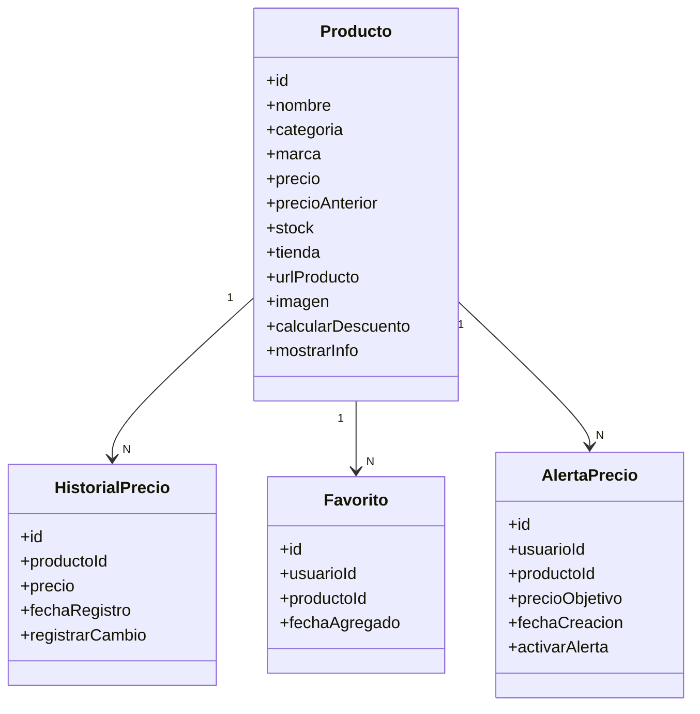
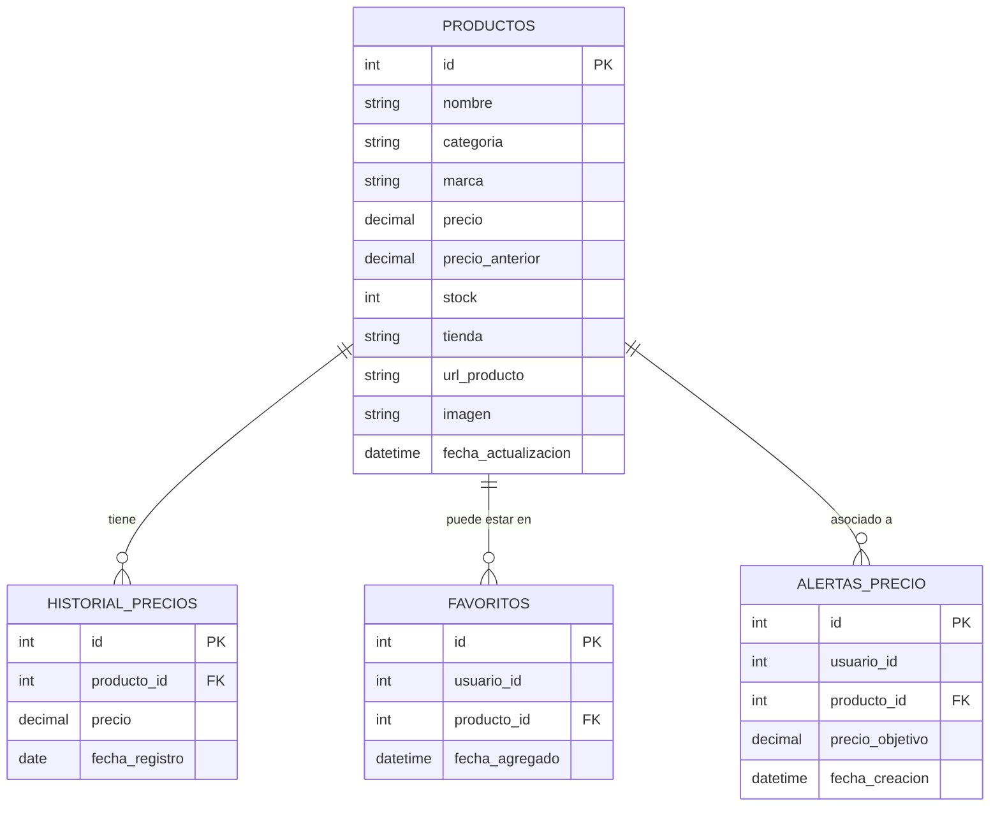

# ForGamers

<h1 style="color:red;"> HardGamers – Comparador de precios de hardware</h1>

---

<h2 style="color:red;"> Descripción del Proyecto</h2>

HardGamers es una **aplicación web desarrollada en React y TailwindCSS** que permite comparar precios de componentes de PC de distintas tiendas argentinas en tiempo real.  
Su objetivo es ayudar a los usuarios a **encontrar la mejor oferta disponible**, reduciendo el tiempo de búsqueda y evitando pagar precios excesivos.

La plataforma permite **filtrar productos por marca, categoría y rango de precios**, guardar favoritos, activar alertas y ver un **historial de precios** con un diseño moderno y responsivo.

---

<h2 style="color:red;"> Objetivo General</h2>

> Desarrollar una aplicación web interactiva que permita comparar precios de hardware en distintas tiendas argentinas, facilitando la decisión de compra para los usuarios.

---

<h2 style="color:red;"> Objetivos Específicos</h2>

1. Diseñar una interfaz moderna y responsive usando React y TailwindCSS.  
2. Implementar filtros dinámicos de búsqueda y categorías.  
3. Incorporar un sistema de favoritos y alertas de precio.  
4. Crear un historial de precios con visualización gráfica.  
5. Publicar el proyecto en un hosting gratuito accesible (Vercel / Netlify).  
6. Gestionar las tareas en Trello y el código en GitHub con la metodología Scrum.  

---

<h2 style="color:red;"> Problema a Resolver</h2>

Los gamers y entusiastas del hardware suelen perder tiempo revisando múltiples sitios para comparar precios.  
HardGamers unifica la información en un solo lugar, mostrando los productos, su disponibilidad y evolución de precio de forma clara y rápida.

---

<h2 style="color:red;"> Cliente y Usuarios</h2>

- **Cliente objetivo:** consumidores de tecnología y videojuegos.  
- **Usuarios:** compradores de hardware (particulares, técnicos o entusiastas).  
- **Valor agregado:** centralización de información y ahorro de tiempo/dinero.  

---

<h2 style="color:red;"> Beneficio Comunitario</h2>

Promueve la **transparencia de precios** y el acceso informado a productos tecnológicos, ayudando a la comunidad gamer argentina a optimizar sus compras.

---

<h2 style="color:red;"> Tecnologías Utilizadas</h2>

| Área | Tecnologías |
|------|--------------|
| **Frontend** | React + Vite + TailwindCSS |
| **Gráficos** | Recharts (historial de precios) |
| **Control de versiones** | Git / GitHub |
| **Gestión del proyecto** | Trello |
| **Hosting** | Vercel |
| **Base de datos (opcional)** | MySQL |

---
# 🔴 Diagrama de Clases (Mermaid UML)

---
# 🔴  Diagrama de Base de Datos

